# Distinguishing AI-Generated and Real Pictures Using a Model Trained for Image Forensics

With the rapid technological advances in generative artificial intelligence (AI), determining if an image is synthetic or real is becoming increasingly difficult. The present work evaluated a baseline on the CIFAKE dataset and then progressively improved its architecture. The baseline deploys a frozen ResNet-50 for binary classification. In the first enhancement, each image is processed through three Spatial Rich Model (SRM) high-pass filters, producing residual noise maps that highlight generative inconsistencies, then, a dual-branch network learns from those residuals and the RGB features. The second enhancement integrates a modified Convolutional Block Attention Module (CBAM) attention mechanism into a ResNet-50 backbone, where both channel and spatial attention receive noise maps as auxiliary signals, and additionally includes a third branch that uses a Fourier transform to capture frequency variations, which are normally very present in synthetic images. Experimental results show consistent improvements over the baseline, demonstrating the effectiveness of explicitly modeling residual noise and frequency cues when distinguishing real images from AI-generated ones.

---

## Methodology

### Baseline

The baseline model deploys a frozen ResNet-50 pretrained on ImageNet, followed by a binary classification head. Input images are normalized using standard ImageNet statistics. The CIFAKE dataset is used with a 10\% subset to reduce computational load, consisting of 10,000 training images and 2,000 test images distributed across the 'REAL' and 'FAKE' classes.

### First Enhancement: SRM Noise Maps and Dual-Branch Fusion

Residual noise maps were extracted using a set of Spatial Rich Model (SRM) high-pass filters, applied to each image prior to training. A dual-branch architecture is then constructed: one branch processes the RGB image through a ResNet-50 backbone, which is initially frozen and later partially fine-tuned, while the second processes the corresponding noise map through a lightweight convolutional module. Both representations are fused prior to classification. Data augmentation is applied using the same geometric transformations on each image and its corresponding noise map.

### Second Enhancement: Modified CBAM and Fourier Branch

The second enhancement integrates a modified Convolutional Block Attention Module (CBAM), in which channel and spatial attention mechanisms are guided by previously extracted residual noise maps and internal layer activations. A separate Fourier branch is added to capture frequency anomalies that are usually present in AI-generated images, and its output of this branch is fused with the backbone features before classification.

## Setup

Experiments are conducted on the CIFAKE dataset using the official train/test split, reduced to 10\% of its original size to limit computational cost. Models are trained for 10 epochs with the Adam optimizer and evaluated with its accuracy, AUC, confusion matrices, and per-class metrics. All experiments were executed in a GPU-accelerated environment.

## Results

### Baseline Model

#### Plots
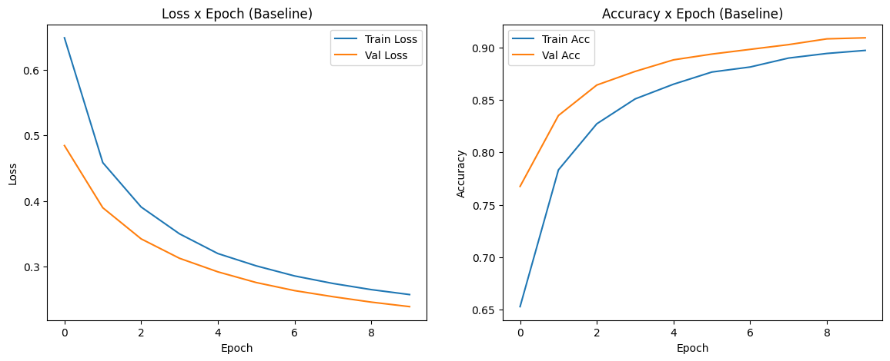
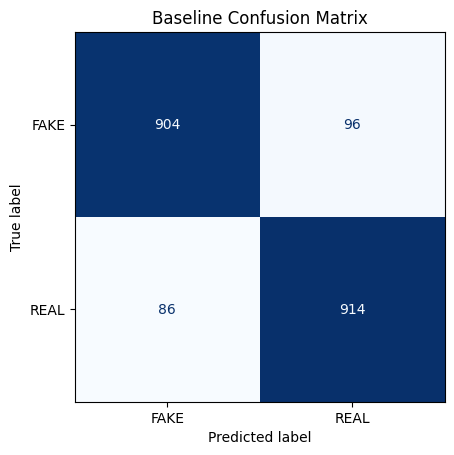
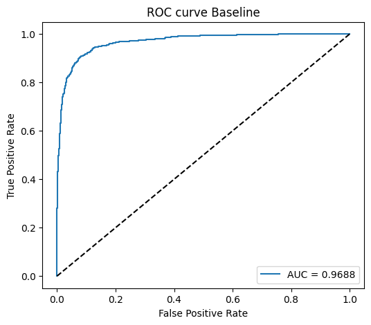

#### Classification Report

| Class | Precision | Recall | F1-score | Support |
|------|-----------|--------|----------|---------|
| FAKE | 0.91 | 0.90 | 0.91 | 1000 |
| REAL | 0.90 | 0.91 | 0.91 | 1000 |
| **Accuracy** | — | — | **0.91** | 2000 |
| **Macro Avg** | 0.91 | 0.91 | 0.91 | 2000 |
| **Weighted Avg** | 0.91 | 0.91 | 0.91 | 2000 |

### First Enhanced Model

The first enhancement substantially improves the model’s ability to detect synthetic samples, but the performance on real images decreases.

#### Plots
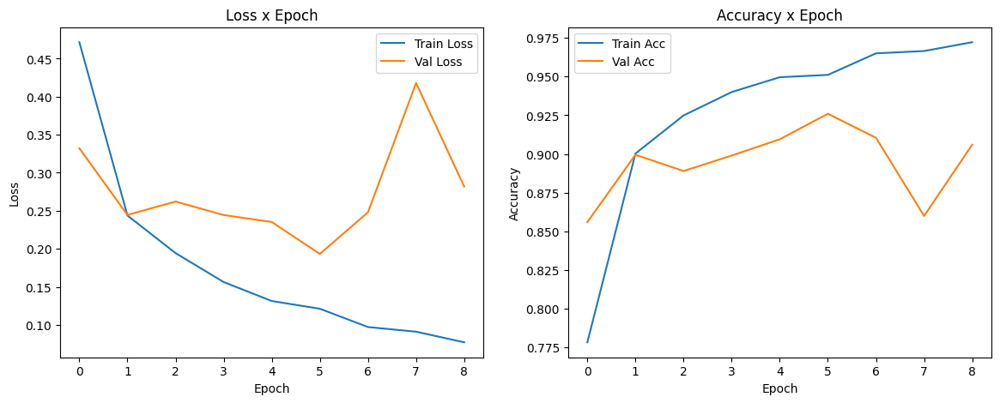
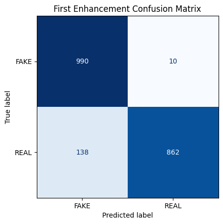
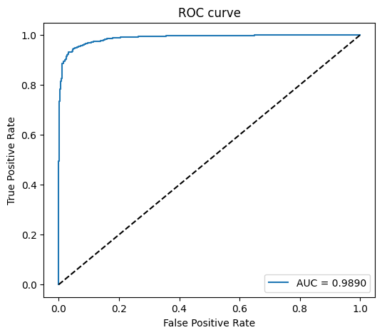

#### Classification Report

| Class | Precision | Recall | F1-score | Support |
|------|-----------|--------|----------|---------|
| FAKE | 0.88 | 0.99 | 0.93 | 1000 |
| REAL | 0.99 | 0.86 | 0.92 | 1000 |
| **Accuracy** | — | — | **0.93** | 2000 |
| **Macro Avg** | 0.93 | 0.93 | 0.93 | 2000 |
| **Weighted Avg** | 0.93 | 0.93 | 0.93 | 2000 |

### CBAM-Enhanced Model

At first it obtained 97% accuracy with the same reduced dataset (10%) as the others, but I also wanted to train it with more data, so I also trained it with 60% of the dataset, which obtained 98%. 

#### Plots - 10%
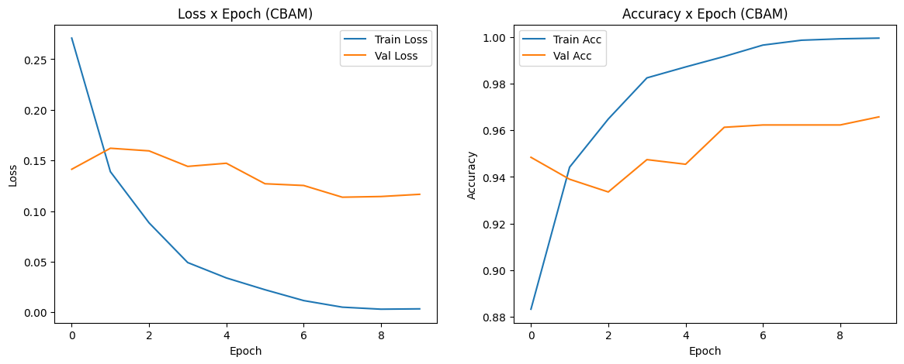
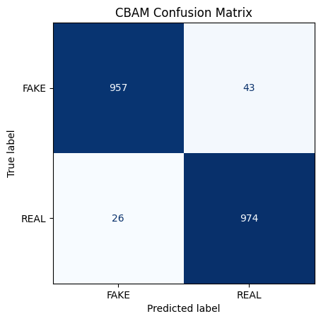

### Classification Report - 10%

| Class | Precision | Recall | F1-score | Support |
|------|-----------|--------|----------|---------|
| FAKE | 0.97 | 0.96 | 0.97 | 1000 |
| REAL | 0.96 | 0.97 | 0.97 | 1000 |
| **Accuracy** | — | — | **0.97** | 2000 |
| **Macro Avg** | 0.97 | 0.97 | 0.97 | 2000 |
| **Weighted Avg** | 0.97 | 0.97 | 0.97 | 2000 |

#### Plots - 60%
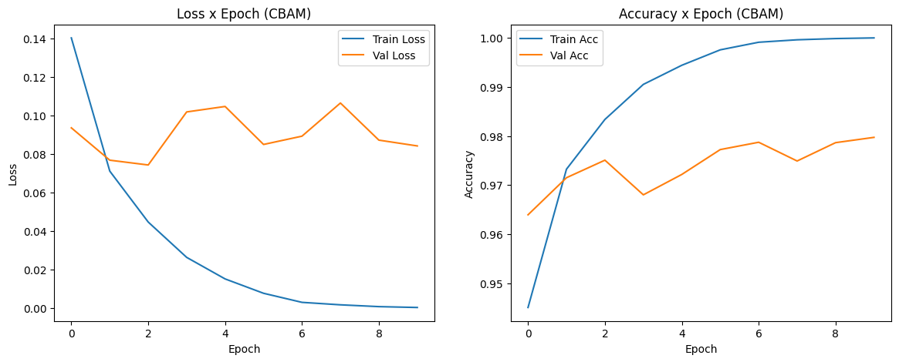
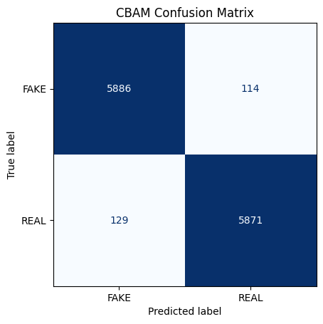
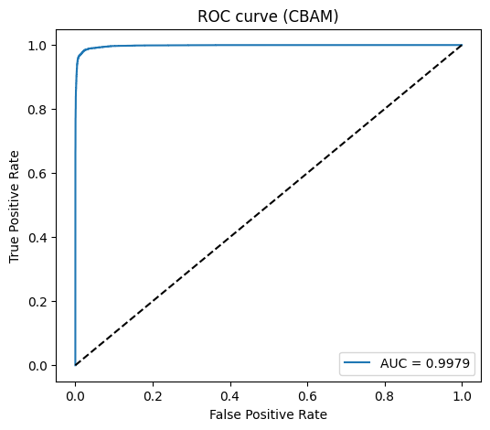

#### Classification Report - 60%

| Class | Precision | Recall | F1-score | Support |
|------|-----------|--------|----------|---------|
| FAKE | 0.98 | 0.98 | 0.98 | 6000 |
| REAL | 0.98 | 0.98 | 0.98 | 6000 |
| **Accuracy** | — | — | **0.98** | 12000 |
| **Macro Avg** | 0.98 | 0.98 | 0.98 | 12000 |
| **Weighted Avg** | 0.98 | 0.98 | 0.98 | 12000 |

---

### Image analysis
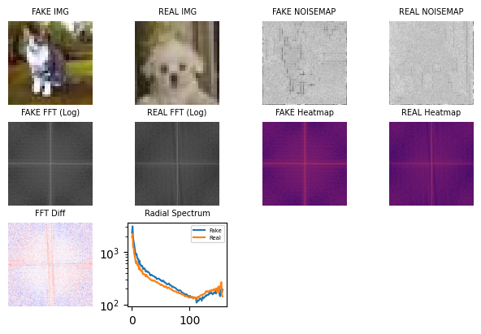
---

## Qualitative Predictions

Qualitative examples of correct predictions from the final model are shown bellow.

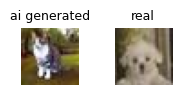

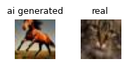

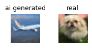

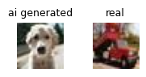

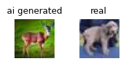

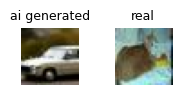

---
